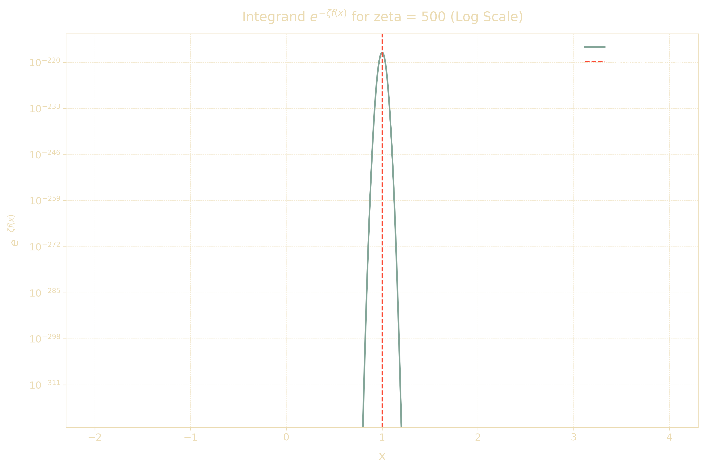

# Saddle Point Approximation

This project implements the **Saddle Point Approximation (SPA)** in Python for evaluating integrals of the form:

$$
\mathcal{J} = \int_{-\infty}^{\infty} e^{-\zeta f(x)} dx
$$

The SPA method is especially useful for evaluating integrals when \( \zeta \) is large and \( f(x) \) has a global minimum. The project includes code for approximating integrals, generating visualizations, and comparing results with numerical methods.

## An example of the output of an integrand

With the SPA:

